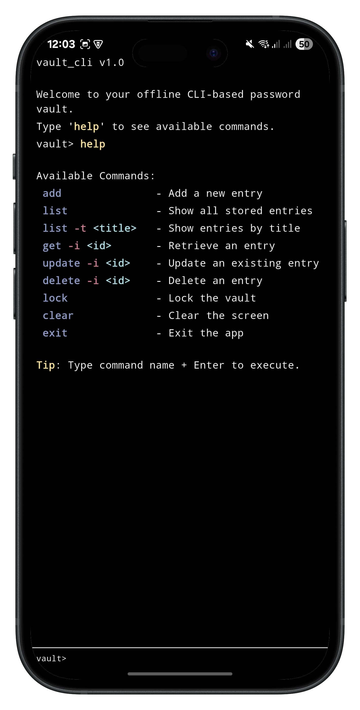
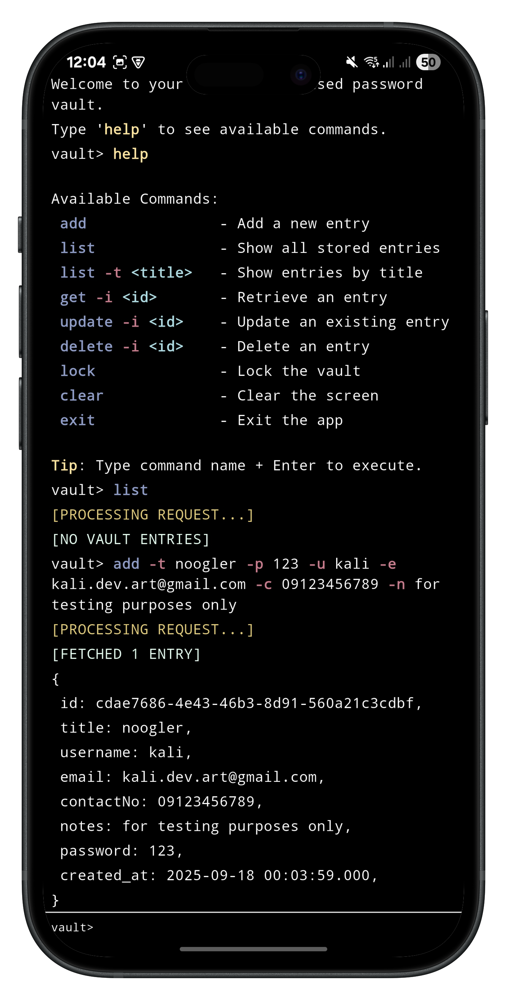
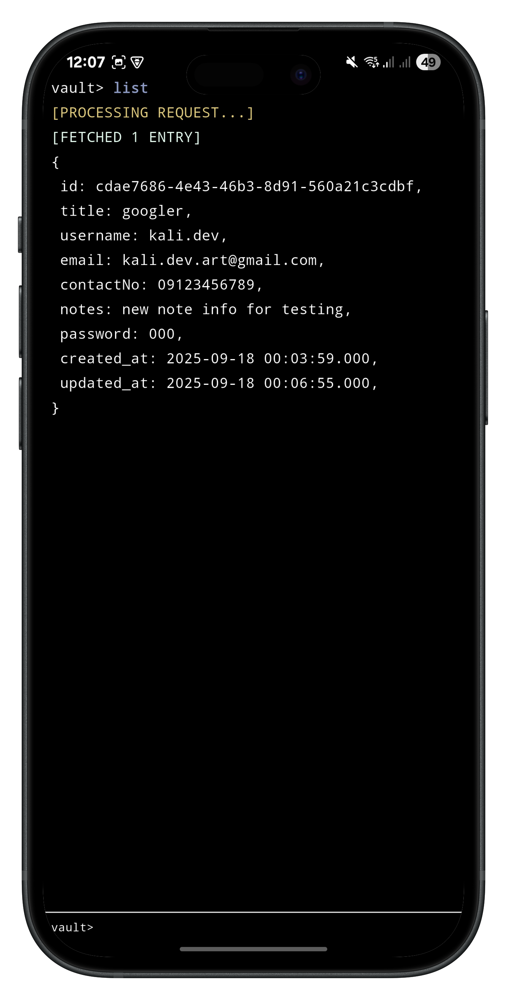
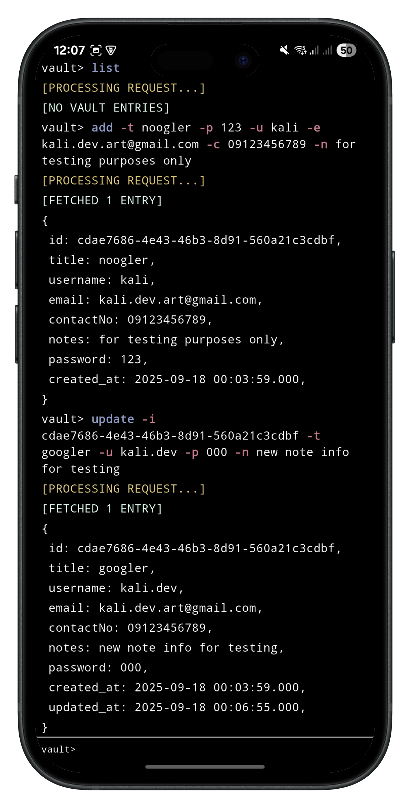
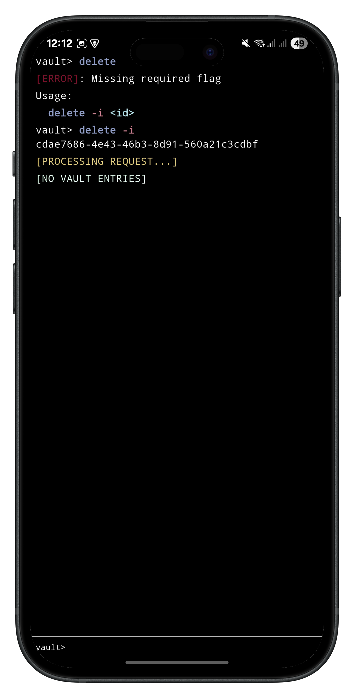

# vault_cli (in-development) 🔐
A simple, secure, **offline**, CLI-based password vault built with **Flutter (Dart)**.

## 🚀Overview
`vault_cli` is a local, command-line password manager designed with **security first**.
That being said, you can:
- Initialize a secure vault with a **master password**
- Store, encrypt, and manage password entries
- Unlock the vault whenever you need to access your data

## 🔒Security
Your data is protected with **industry-standard cryptography**:

- **PBKDF2-HMAC-SHA256** for key derivation
    - 200,000 iterations to slow down brute-force attacks
    - Unique per-vault random salt securely stored
- **AES-GCM-256** encryption for entries
    - Provides confidentiality and integrity with authenticated encryption
    - Each entry uses a unique random nonce
- **SHA-256** for hashing
    - To ensure data won't be retrieved to its original form even if local storage is compromised

## Featured Commands

## 📦 Features (Current)
- Master password setup and vault initialization
- Vault unlocking with secure key derivation
- Add, update, delete, and view entries (encrypted)
- Local persistence (SQLite for entries + secure storage for keys)
- CLI UI improvements (syntax highlighting, better prompts)
- Master password recovery/reset
- Disable screenshot (Android)

## 🛠 Planned Features
- Auto-lock vault after inactivity
- Disable screenshot (iOS)
- Clipboard integration for easy copying
- Optional export/import of vault data (encrypted)

## 🖼 Screenshots

**Master Password Setup**  

**Help Command**  

**Adding an Entry**  

**Listing Entries**  

**Updating an Entry**  

**Deleting an Entry**

## 🧑‍💻 Tech Stack
- **Flutter/Dart**
- **Drift ORM + SQLite** – type-safe, local db storage
- **flutter_secure_storage** – secure storage for master key + salt
- **cryptography** – PBKDF2 & AES-GCM implementations
- **Bloc** - predictable, event-driven state management
- **Clean Architecture** - modular, structured, and testable design
