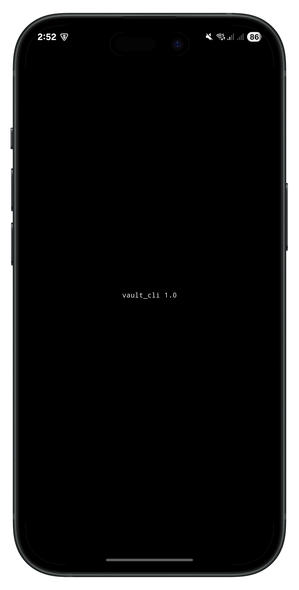
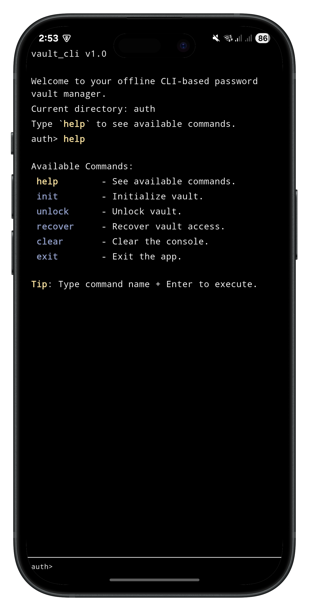
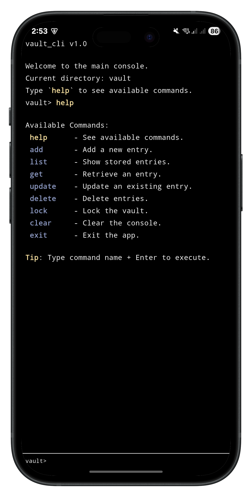

# vault_cli (in-development) 🔐
A simple, secure, **offline**, CLI-based password vault built with **Flutter (Dart)**.

## 🚀Overview
`vault_cli` is a local, command-line password manager designed with **security first**.
That being said, you can:
- Initialize a secure vault with a **master password**
- Store, encrypt, and manage password entries
- Unlock the vault whenever you need to access your data

## 🔒Security
Your data is protected with **industry-standard cryptography**:

- **PBKDF2-HMAC-SHA256** for key derivation
    - 200,000 iterations to slow down brute-force attacks
    - Unique per-vault random salt securely stored
- **AES-GCM-256** encryption for entries
    - Provides confidentiality and integrity with authenticated encryption
    - Each entry uses a unique random nonce
- **SHA-256** for hashing
    - To ensure data won't be retrieved to its original form even if local storage is compromised

## 🔑 Featured Commands

### 🔐 Auth Commands
| Command   | Usage                                                                          | Description                                                     |
|-----------|--------------------------------------------------------------------------------|-----------------------------------------------------------------|
| `init`    | `init -m <master password> -q <recovery question> -a <recovery answer>`        | Initialize a new vault with a master password and recovery Q&A. |
| `unlock`  | `unlock -m <master password>`                                                  | Unlock the vault for use.                                       |
| `set new` | `set new -m <master password> [-q <recovery question>] [-a <recovery answer>]` | Set a new master password, optionally updating recovery Q&A.    |
| `recover` | `recover`                                                                      | Recover vault access using recovery question and answer.        |

---

### 📦 Vault Commands
| Command  | Usage                                                                                                  | Description                           |
|----------|--------------------------------------------------------------------------------------------------------|---------------------------------------|
| `add`    | `add -t <title> -p <password> [-u <username>] [-e <email>] [-c <contact>] [-n <notes>]`                | Add a new entry.                      |
| `list`   | <pre>list all list -t &lt;title&gt;</pre>                                                           | Show all entries or filter by title.  |
| `get`    | `get -i <id>`                                                                                          | Retrieve a specific entry by ID.      |
| `update` | `update -i <id> [-t <title>] [-p <password>] [-u <username>] [-e <email>] [-c <contact>] [-n <notes>]` | Update an existing entry.             |
| `delete` | <pre>delete all delete -i &lt;id&gt;</pre>                                                          | Delete all entries or a specific one. |
| `lock`   | `lock`                                                                                                 | Lock the vault manually.              |

---

### ⚙️ Shared Commands
| Command | Description             |
|---------|-------------------------|
| `help`  | See available commands. |
| `clear` | Clear the console.      |
| `exit`  | Exit the app.           |

---

💡 **Tip:** Just type the command name and press **Enter** to execute.

## 📦 Features (Current)
- Master password setup and vault initialization
- Vault unlocking with secure key derivation
- Add, update, delete, and view entries (encrypted)
- Local persistence (SQLite for entries + secure storage for keys)
- CLI UI improvements (syntax highlighting, better prompts)
- Master password recovery/reset
- Disable screenshot (Android)

## 🛠 Planned Features
- Auto-lock vault after inactivity
- Disable screenshot (iOS)
- Clipboard integration for easy copying
- Optional export/import of vault data (encrypted)

## 🖼 Screenshots

**Splash Screen**  

**Auth CLI**  

**Vault CLI (Main)**  

## 🧑‍💻 Tech Stack
- **Flutter/Dart**
- **Drift ORM + SQLite** – type-safe, local db storage
- **flutter_secure_storage** – secure storage for master key + salt
- **cryptography** – PBKDF2 & AES-GCM implementations
- **Bloc** - predictable, event-driven state management
- **Clean Architecture** - modular, structured, and testable design
